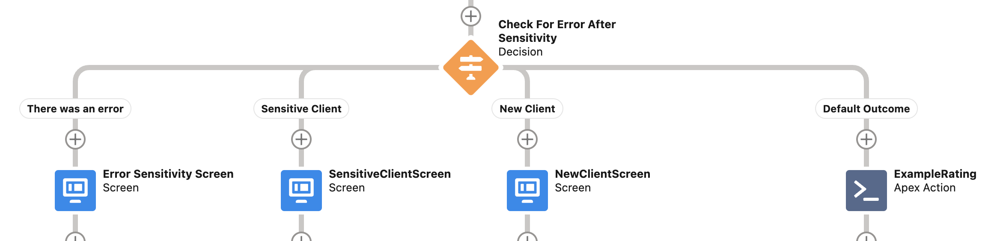
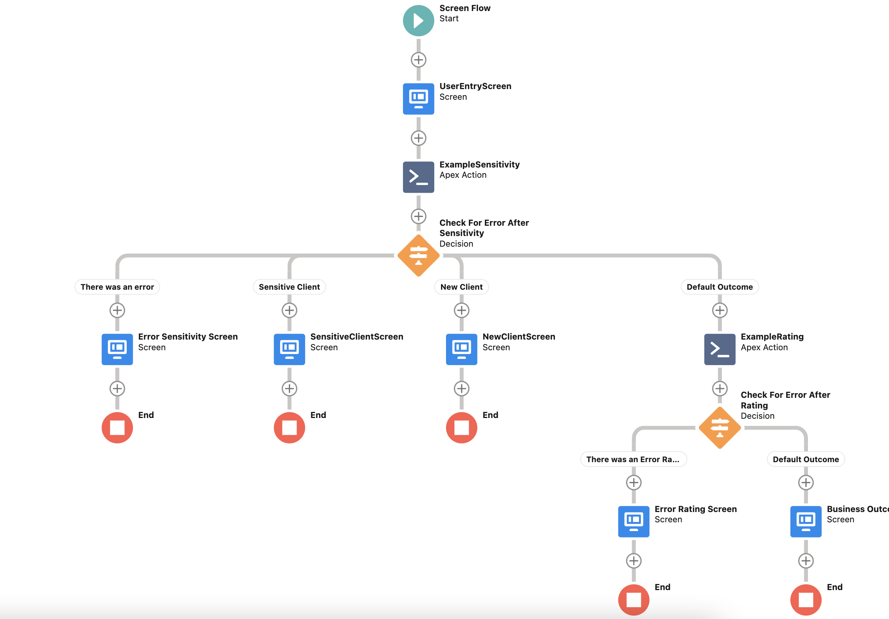

## Chaining Invocations in Flow

We have seen on [Handling Responses - Apex](ErrorHandling.md) how to combine multiple invocations of services in Apex to implement a business process in a class called *ExampleMulitpleCalls*. Here we will provide guidance on how to implement the same Use Case in flow. We will implement a Screen Flow but the steps for headless flow types are the same.


Whilst running through this example you might want to open [Handling Responses - Apex](ErrorHandling.md) in an adjacent tab or window - we won't repeat the requirement here and it is enlightening to see the similarities between the Apex and Flow cases.


### Step 1: Input Data

First off, create a screen flow called *Chaining Invocations Rating Example* and as a first element create a screen with API name *UserEntryScreen*. In that screen add a text box with API name *FullName*. You can optionally set a default value of *Barack Obama*. Whatever is entered in this box will be the input to our two service invocations.

### Step 2: Invoke the Sensitivity service

This is where it starts to get more interesting. After the *UserEntryScreen* add an Action. In the New Action screen you will see a category called *Microscope Actions*. Select this and in the Action search box select *Microscope: String to String Invocation*. 



What is this? In order to invoke Apex from flow a class with an *InvocableMethod* needs to be referenced. This class must specifies input and output types that the flow uses to call Apex. In this case we want to invoke a service with a *String => String* signature, hence the name of the Microscope Action we have selected. 

Optional: If you are interested in how this works, you can see the implementation of this class in [ActionStringString.cls](https://github.com/kevinhenryburke/frictionless/blob/master/serviceBase/force-app/Framework/classes/flow/actions/reusable/ActionStringString.cls). You'll see an inner class called *InputFromFlow* which are the parameters that Flow will provide. This has two members:

* The name of the Invocation we want to run
* The input data, in this case a String

The invocable method takes this input, initializes and invocation using the invocation name provided in the input, and runs *invokeService()* on this. If you look back at [Handling Responses - Apex](ErrorHandling.md) this is precisely the same pattern that was used there, but here it is not something that the flow developer needs to worry about directly.

Finally the invocable method populates a response which will be available to the flow as the output parameters. This also consists of two members

* The Invocation Details that we created when the invocation was initialized and enriched as the service was invoked. 
* The output data, in this case a String

Using the Invocation Details, the flow can investigate the State and Business Outcome attributes which will guide how the flow should continue processing.





Because each *InvocableMethod* needs to explicitly specify both an input and output parameter list to a flow there is a strong chance that a project team will need to write their own invocable methods as Microscope can only provide some common use cases. 

However once one is written for an input / output pair then it is resuable for any calls with the same parameters. The *Microscope: String to String Invocation* is reusable for any invocation with that signature for example. More useful however is the Spring 20 innovation [Build Invocable Actions That Work for Multiple Objects](https://help.salesforce.com/s/articleView?id=release-notes.rn_forcecom_flow_fbuilder_dynamic_types.htm&type=5&release=224), as a result of this the Microscope Action *Microscope: SObject to SObject Invocation* can be used for a large number of use cases.


Back to the example, after selecting the *Microscope: String to String Invocation* we enter the new action screen which we populate as below. We'll call the flow element *ExampleSensitivity* (the same name as the invocation it calls) and also use that value for the *InvocationName* input parameter. The *InputData* parameter is the value we entered in the first screen's text box

### Step 3: Routing depending on Business Outcome

Looking back again at [Handling Responses - Apex](ErrorHandling.md), after the invocation we had a switch statement with a number of options and we'll do the same in Flow but with a Decision element. We can define our Outcome Options as:

1. There was an error: use the output from the ExampleSensitivity invocation action. Select InvocationDetails / State - if this does not equal "SUCCESS" there was an error. Create a screen on this decision path to that affect to show it was followed and routed to the Admin Team and we are done
2. Sensitive Client: use the output from the ExampleSensitivity invocation action but InvocationDetails / BusinessOutcome this time. If this value is 'Sensitive Client' then we have need to route to the Sensitive Client Team and we can put a screen to that affect too. This is the end of this processing line.
3. New Client: InvocationDetails / BusinessOutcome = 'New Client' and to route to the Sales Team, again adding a screen to that affect if you wish.
4. Default: If the client is a standard client we need to look at their rating. This is the next step.

### Step 4: Invoke the Rating service for Standard Clients

In the Default outcome patch create another new *Microscope Actions*. Select this and in the Action search box select *Microscope: String to String Invocation*. This time call the flow element *ExampleRating*, use that value also for the *InvocationName* input parameter and again the *InputData* parameter is the value we entered in the first screen's text box.

### Step 5: Perform different actions for different Rating Business Outcomes.

Put a Decision Gate below the *ExampleRating* which this time has two outcome paths:

1. Low-Rated Client: Use the output from the ExampleRating invocation action and check InvocationDetails / BusinessOutcome and check if the value is *Low-Rated Client*. If so we put a screen on this path to show that this is routed to the Client Risk Team.
2. Default outcome: Otherwise add a screen to state we are routing to the Services Team. 

## Summary / Identified Patterns

After we are done our flow will looks something like this. 

Notice the repeating pattern of an Apex Action calling an invocation followed by a Decision Gate which looks at a combination of the Invocation Details' *State* and *BusinessOutcome* parameters to route the user down the right path. This is a common path. 

Also note we have no Fault paths from our Apex Actions. This is because Exceptions are caught by the framework so will never be returned to the flow. The implicit Fault path is in fact contained in the Decision Gate always having as its first outcome a path for when InvocationDetails.State != "SUCCESS".

