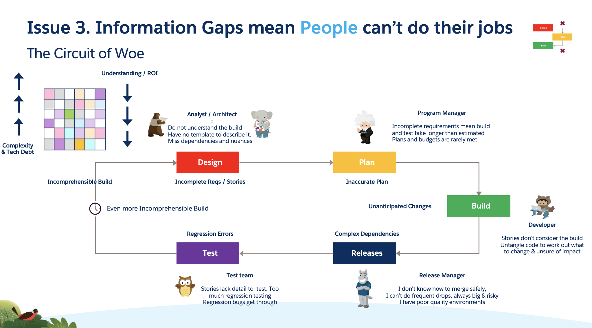
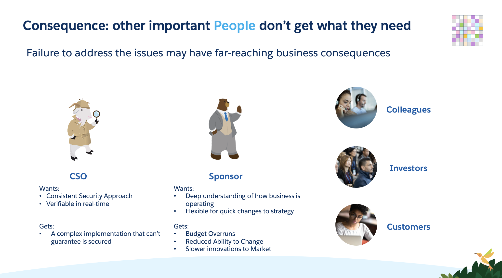

Because of the lost connections and opacity of the build people designing the build cannot understand or articulate the consequences of any suggested change

There is a significant disconnect between design and delivery, and between Shapers and Deliverers, which leaves Deliverers set up to fail.
Detailed Story should inform all beneath
In reality a story is significantly re-written by developers because those above don’t know the build. The dev team are then too busy to document. They have to then be a source of information for all downstream. The longer it goes on the worse the disconnect gets.

