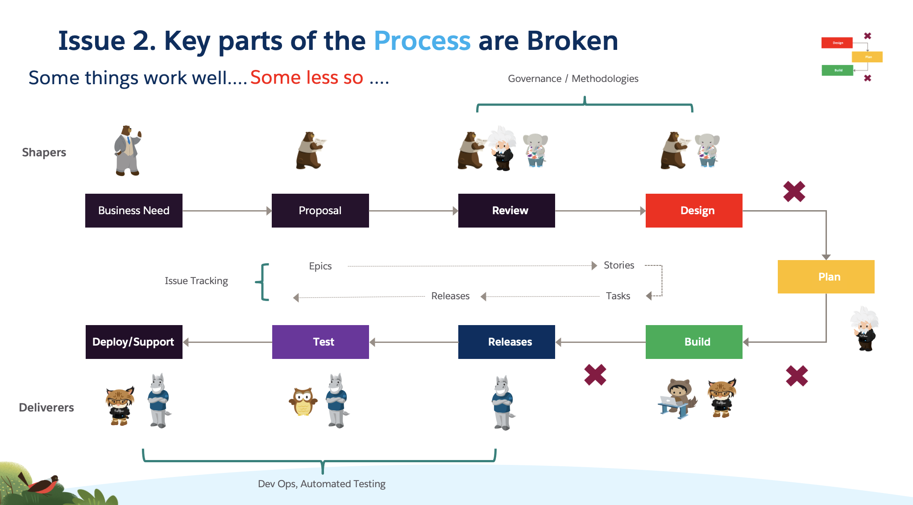

The lack of understanding leads us to the second problem

First animation reveals Governance Investment
Second reveals DevOps investment
Third reveals is issue tracking
Fourth reveals the problem areas X and the improvement areas + . Often companies have not addressed the areas in between. 

Investment in Governance and DevOps still leaves problem areas, notable between design and build

There is a significant disconnect between design and delivery, and between Shapers and Deliverers, which leaves Deliverers set up to fail.
Detailed Story should inform all beneath
In reality a story is significantly re-written by developers because those above don’t know the build. The dev team are then too busy to document. They have to then be a source of information for all downstream. The longer it goes on the worse the disconnect gets.

