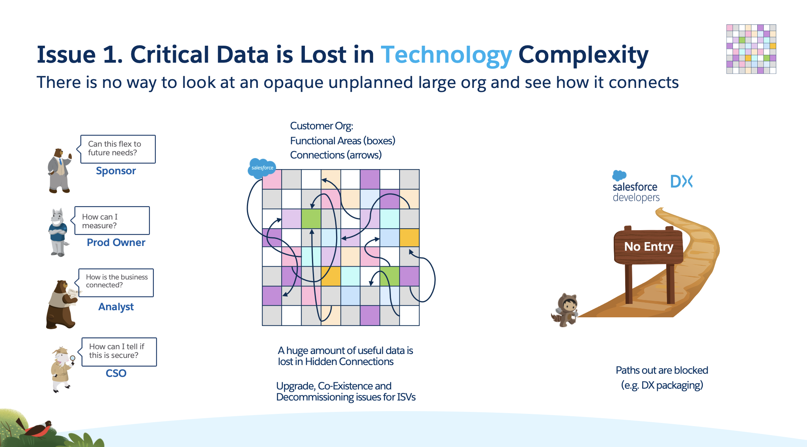

Without structure there is no way to look into an org and see how everything connects

Without structure and planning every new business rule introduces another piece of complexity, and another impact to check each time you want to make a change.

In fact the number of connections increases at a greater rate than the number of new components we add. 
Your developers (but only your developers) can understand a particular process, but they cannot understand the impact of change.

Opacity of the code: not just the number of blocks that is the problem but a second order of magnitude is the connections between them
Companies don’t even know what they are using (e.g. NE Based tech firm), can’t extricate used functionaltiy

These are the dependencies and the high level pictures of how the org fits together, what parts owned by what business owners interact
