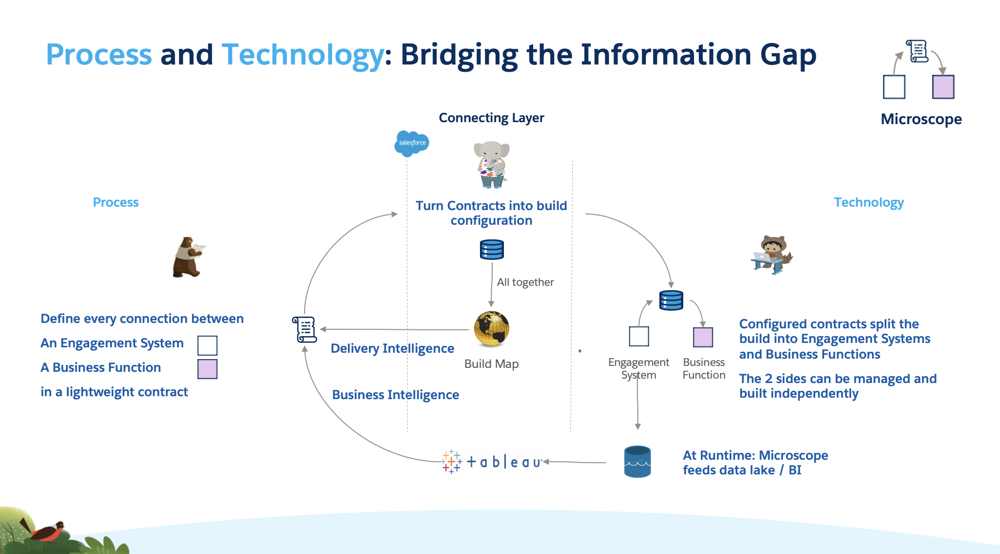

We have determined that we need to make a connection between the Delivery *Process* and the Build *Technology*, but what is the best way to do this. Let's look at the Process side and imagine our Business Analyst and Designers have been charged with defining some new functionality. Let's further assume that they have a full view of the build, in reality in many orgs this is not the case of course, but we'll assume we do to show how we can continue to retain visibility of the org when new functionality.

The Designers should look for connections between different functional areas within the new requirement that are new or need to change. They should define a *Lightweight Contract* between these, so for example between an Engagement Technology like a Flow or Omnistudio Omniscript and a Business Function, iike a a new account creation process or a pricing engine.

Once this is complete the Architect turns these contracts into Microscope configuration records, encapsulated in the Custom Metadata Type Records. These records serve very distinct purposes:

* The set of the all the configurations taken together, with some informative tooling written over them, provides a **Build Map** that shows the structure of the entire org's connections. This goes a long way to delivering the [Delivery Intelligence](./DeliveryIntelligence.md) we will see soon.

* They drive the build. Whenever a developer invokes the *Microscope Engine*, the Engine inspects these configruations to determine which methods or flows will be called. 

* Each time an invocation runs it records the configuration details that have been used and dynamic information (users, timing, input, output, calling context) and records this information in an Audit object. These can be subsequently processed in a BI tool like Tableau or CRM Analytics and used to provide the [Business Intelligence](./BusinessIntelligence.md) we'll see soon.

Armed with this intelligence about the connections in the org will arm the Analysts and Designers when the next set of the requirements come in. In this way the structure of the org remains clear no matter how many functions are developed inside it.

Contracts on the business side
Services on the technical side
And a may of interpreting between the two

