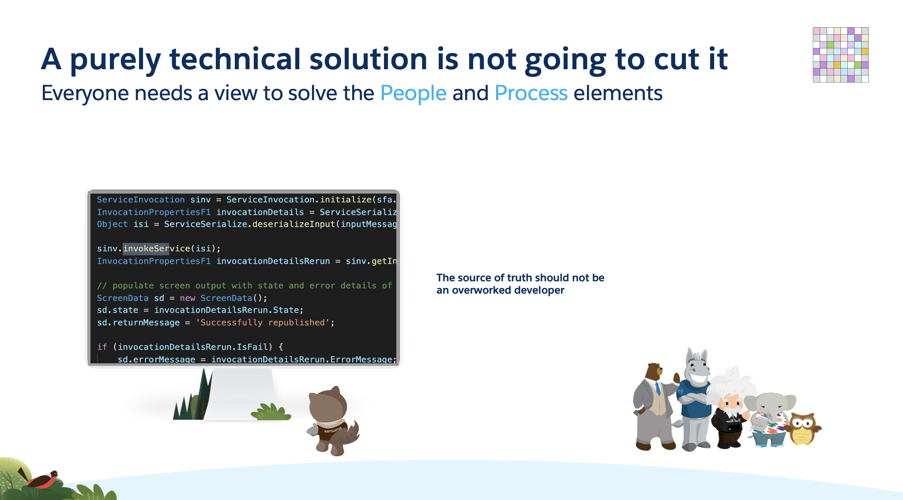
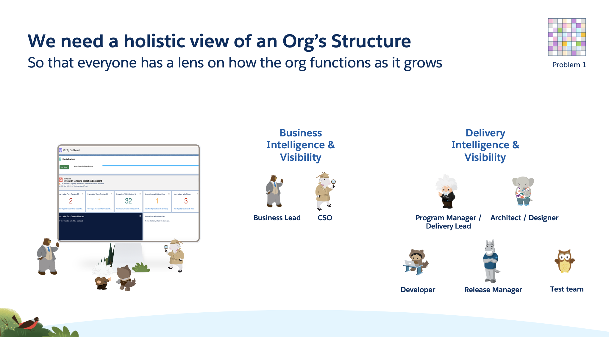

Firstly let's consider what will not work. Fundamentally we have a visibility problem. The lack of a high level view leads to problems in understanding across the full team. Information is not readily available and the developer becomes the source of truth, and they are constantly distracted from their real work as they go through the often complex task of working out what is really happening in the build when an action is performed.

So a purely technology-based solution is not going to help us much. *Everyone* needs a view of the structure of an org, although different lenses will be required for different people.

People working on the devleopment of the system with responsibility for new functionality need [Delivery Intelligence]
(DeliveryIntelligence.md)
 views of the system. They need to see the details of versions of code and method signatures and dependencies so that they can establish the impact of new changes and the scope of any such change. We need full alignment across the Program teams in these areas.

People like Business Leaders and Security Teams however need **Business Intelligence**, they need to be able to see who is using the system and what features they are using, a Business Leader needs to understand if the system is being used appropriately by their teams and customers whilst a CSO may want assurance that functions are being used by only the right people and using the right mechanisms.

In gnerenal in a large enterprise one cannot trust documentation to be accurate and up to date. Only by viewing the live system as the source can one be sure one's view is always up to date in a fast moving environment.

