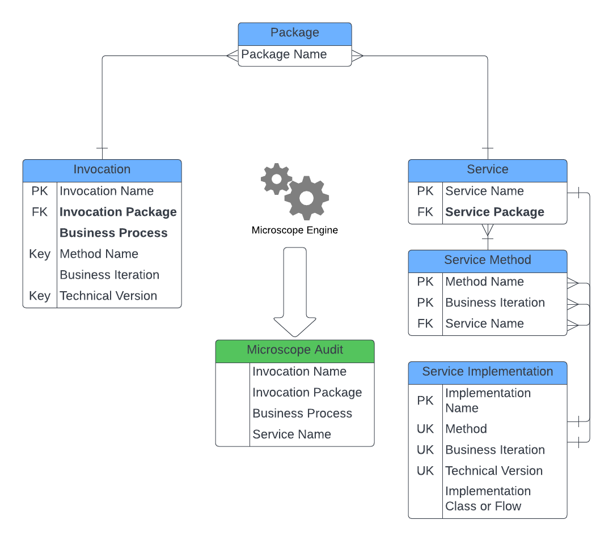

## Key Microscope Concepts

In *Microscope* we consider a **Connection** to be a decouplong between parts of the build. 

A Connection has two sides, an **Invocation** and a **Service**. The Invocation states what it wants to run, the Service, its *Methods* and their *Versions*, whilst the Service side determines what the implementation should be from that information. 

At run time, invocations and services are connected via the **Microscope Engine**. The Engine connects the invocation with the implementation that needs to run and runs it. In addition the Engine will look at the input and output data from each call, user, timing, status and metric information and record data in the **Microsope Audit** object. 

Invocations and Services both belong to **Packages**. These are connected groups of functionality, all of which are under the control of a single business owner and a development team. These may or may not correspond to Salesforce DX Packages but in *Microscope* the term Package does not necessarily infer a DX Package. Additionally each Inovcation should be considered to be part of a **Business Process**, this is a soft term in *Microscope*, it is not a build construct as such, but a free-text field on an invocation that helps to map our [Storying](../vision/Storying.md) to the build.

Ultimately all of the Connections, the Invocation and Services, the Packages and the Business Processes all combine to form a **Build Map**, a set of tooling that sits on top of the *Microscope* configuration that both explains the implementation and informs the future design.

An Invocation can also be considered to be a **local invocation** too. In these cases the Invocation and Service Packages are the same and are under the control of the development team. For local invocations the invocation may express the implementation explicitly
