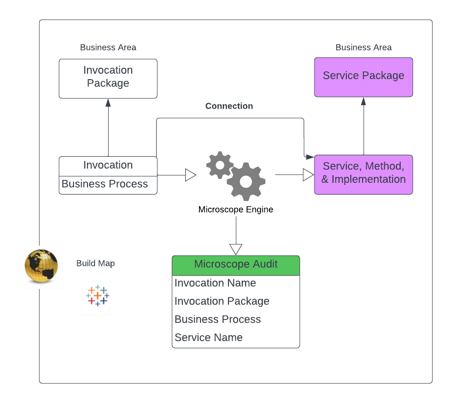

In [Connections, Process and Build](ConnectionsProcessBuild.md) we discussed the importance of understanding connections between different functional areas and how implementing contracts that represent the connections could provide a huge benefit in visibility of an org's structure. And finally how enscaptulating these in configuration was the final key to the puzzle. We're ready to start to define the key concepts that make up *Microscope* and atart to get a feel for how we deliver on the promise to increase visibility and understanding for the full team.

## Key Microscope Concepts

In *Microscope* we consider a **Connection** to be a decouplong between different parts of the build. 

A Connection has two sides, an **Invocation** and a **Service**. The Invocation states what it wants to run, which Service, *Methods* and *Versions*, whilst the Service side determines which the implementation class or flow should be run based on that information. A typcial Invocation and Service scenario might be a Engagement mechanism (an LWC and its controller) hosting an Invoation and a business function (e.g. a pricing engine) being encapsulated in a Service.

At runtime, invocations and services are connected via the **Microscope Engine**. The Engine connects the invocation with the correct implementation and runs it. In addition the Engine will look at the input and output data from each call, user, timing, status and metric information and record data in the **Microsope Audit** object. 

Invocations and Services both belong to **Packages**. These are connected groups of functionality, all of which are under the control of a single business owner and a development team. These may or may not correspond to Salesforce DX Packages but in *Microscope* the term Package does not necessarily infer a DX Package. Additionally each Inovcation should be considered to be part of a **Business Process**, this is a soft term in *Microscope*, it is not a build construct as such, but a free-text field on an invocation that helps to map our [Storying](../vision/Storying.md) to the build.

The high-level relationships are captured below, the Invocation, Service and PAckage elements are all *Custom Metadata Type* and the *Microscope Audit* is a Custom Object. The Build Map covers the whole piece and is delivered by the realationships, reports on *Microscope Audit*, LWC Components and by taking the data out of the build and analyzing in a BI tool.

Ultimately all of the Connections, the Invocation and Services, the Packages and the Business Processes all combine to form a **Build Map**, a set of tooling that sits on top of the *Microscope* configuration that illuminates the implementation and informs the future design.

## Local Connections

An Invocation can also be considered to be a **local connection** too (we'll use the term *local invocation* interchangeably). In these cases the Invocation and the Implementation are under the control of the same business owner and development team and the invocation expresses the implementation explicitly. This couples the invocation and implementatino more tightly but as they are under the control of the same teams, that is less likely to be an issue. 

Local Invocations still show up in the *Microsoft Audit* and the *Build Map*

## Events

Invocations can also be combined into an Event-Based model, whereby any team working in any business area can subscribe to an *Event*, without the creator of that *Event* needing to know. The term *Event* is perhaps the most overused in the industry, here we mean that any team can attach an asynchronous invocation to an Event published anywhere in the org. We outline this precisely [here](../use-cases/Events.md) but 
