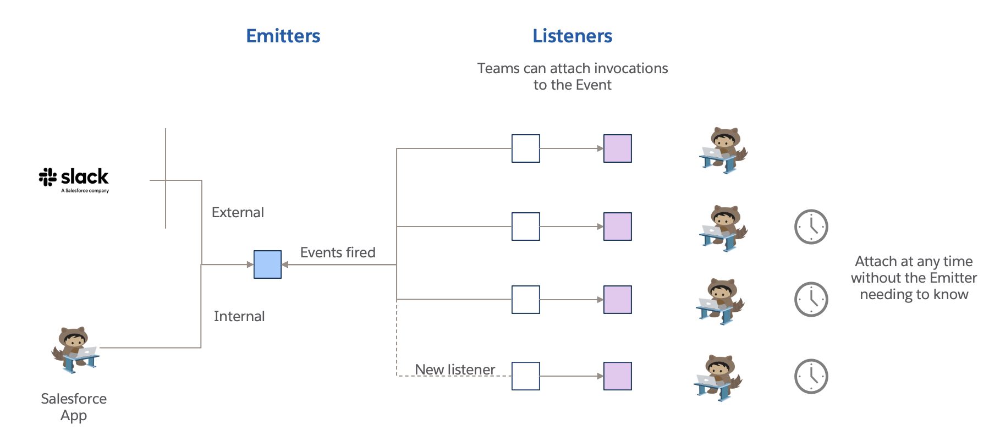

## Event-Based Processing

An Event CMT
Look up from Invocation CMT to Event CMT
New method called Event.fire() - this just runs all of the invocations in a random order.
Can call Event.fire() in a PE Trigger, code, flow controller etc...

Reusable flow templates for stuff (i.e. flow elements ... ??) - new story

Would need validation - however Events should have input signatures only, not output
Validate that all listeners are async.

Would need to add Event to Invocation Details, perm setts, Audit field, CRMA field etc and have an Event correlation id etc

There's some advantages to this
Some of the "listeners" can be sync and some async
Package builders can create a subscription - and will even have their own invocation ids for testing
The Event CMT would need to be inside a "global" package, almost a base level package if it's global, or at a LOB level depending on scope of who is allowed to pick up the event.

