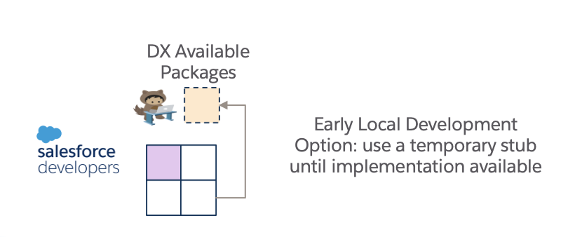

## Temporary Development Stub Pattern



This pattern covers two of our use cases above, 

We need to allow the developer the ability to choose how an invocation fired during a test might be run as, for example, an *Absent Service Stub Class* will run differently if it is run in a scratch or in a full code environment.

### How to use the Pattern

1. On your invocation's *Invocation* CMT Record populate the field *Temporary_Development_Stub_Setting__c* with a string value that will reference the name of a Custom Setting record in *mscope__Service_Environment_Setting__c*. This field value is a *permanent* setting that is available in all environments but which is only used if a Custom Setting record with the referenced name is present in the org.

2. Create the Custom Setting record in *mscope__Service_Environment_Setting__c* with its name set as the value above and with the *String_Value__c* field set to the name of an Apex Class that you wish to run as your temporary stub. 

As noted above, if the Custom Settingrecord is not present in the org, no *Temporary Development Stub* will be run. 
 
*Temporary Development Stubs* take precedence over not just the invocation but all other stub and override patterns too. There is no validation tooling provided at present for Scratch Stubs.

### Early Stage Development Scenario

The developer does not have an implementation of an invocation available to play with. 
* The developer/architect creates the *Invocation CMT* record for the invocation  with the *Temporary_Development_Stub_Setting__c* set as the name of a (to-be) custom setting.
* The developer creates the Custom Setting Record manually in the org that references a temporary class, neither of which are checked into the code repository, at least not a permanent part of the repo (checking into a feature branch and deleting before merge is ok).

### Unit Test Scenario

The developer wants a consistent execution of an invocation across all environments even when the *real* invocation might be different due to environmental differences.

* The developer/architect creates the *Invocation CMT* record for the invocation  with the *Temporary_Development_Stub_Setting__c* set as the name of a (to-be) custom setting.
* The developer creates the Custom Setting Record in the unit test setup code that references an implementing class to use in tests. For example

```

mscope__Service_Environment_Setting__c scratchStub = new mscope__Service_Environment_Setting__c();
scratchStub.Name = 'Tab_Packaging_3_Scratch_Stub' ;
scratchStub.mscope__String_Value__c = 'Tab_Packaging_3_Scratch_Stub' ;
insert scratchStub;
```

Together these steps ensure that every run of the test will be executed the same wherever it is run.


Some notes on this use case

For any invocation inside a unit test, a configured *Absent Service Stubs* will run by default if a Service is not present in the org. If the Service is present then the service implementation is run, otherwise a defined *Absent Service Stub* will run (if the developer has not defined this stub they will find out soon enough in the developer space as the unit test will fail unless a *Temporary Development Stub* is inserted in the test setup).

* An implementing class used only in unit test scenarios should be decorated as *@IsTest*. Any such class will of course need to be checked in to the repository as it forms part of the test suite. This implementing class may also be an inner class of the test class holding the unit test, these are decisions for the developer to take on a case by case basis.

* We note that in a more complex test it is possible that we may wish to stub invocations that are not directly called by the test but are potentially some way down the call stack. Having convenience setup methods for heavily used temporary development stubs for invocations that developers can reuse in their test methods might be beneficial. 


