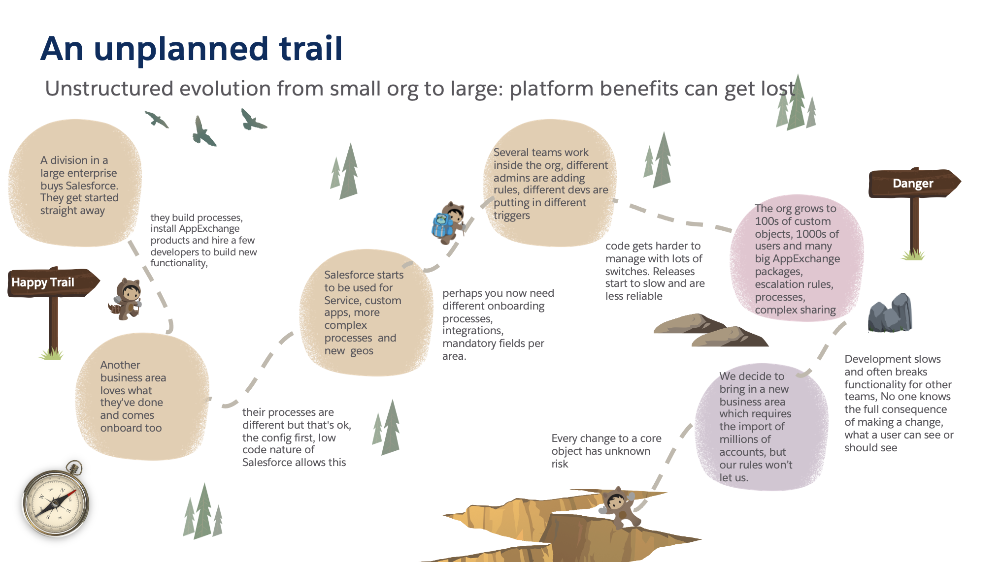

# An Unstructured Org

Before outlining the approach we are recommending and the benefits we
may expect it is important to understand the sorts of situations we are
aiming to avoid (or hoping to repair).

## Emergent Accidental Design in the face of Growth

Many large implementations of Salesforce do not have internal
architectures that were planned. This is often not by negligence on
behalf of any team but a side-effect of a natural evolution. This needs
some explanation.

### How this comes about?

One typical scenario is where a company starts out small on Salesforce
and then puts more functionality into it without a plan on how to grow.

For example a Sales division in a large enterprise buys Salesforce. The
product is excellent and they go through a honeymoon period. They build
some workflows, install lots of AppExchange products and train or hire a
few developers to build up more complex functionality, Another business
area loves what they\'ve done and comes onboard too, their processes are
different but that\'s ok, the config, low code nature of Salesforce
allows this. The success grows, Salesforce starts getting used for
Service and for other geographies and these bring new processing -
perhaps for Service you need new onboarding processes that we trigger on
an account to call out to our customer master or for a new country we
need to have different mandatory fields for a contact. That\'s ok,
Salesforce lets you put conditional logic in your validation rules. We
now have several teams working inside Salesforce, different admins are
adding rules, different devs are putting in different triggers, code
gets harder to manage with lots of switches and teams are not given
extra time by their managers to deliver despite now dealing with a far
more complicated environment.

As we continue to build we reach a point where no one knows the full
consequence of making a change, development slows and sometimes breaks
functionality for other teams, integrations are invisibly updating
fields via the API and extracting unknown numbers of others. We decide
to bring in a new business area which requires the import of millions of
accounts, data sets are prepared and import jobs are prepared but half
of these fail because fields that were mandatory for our existing
Salesforce accounts aren\'t available for our import, some code
somewhere is reformatting addresses in a way that does not work for our
new data, we\'d like to fix this but that format is mandatory for an
AppExchange product that links to a postal service and the mandatory tax
field that one of our processes depends upon is not relevant for the new
data. A simple import ends up taking weeks or months as we untangle a
myriad of knots in our implementation. From this point onwards even a
small change is going to be hard.

A further consideration is that every year the tools available to
developers gets better and better, the number of features that can be
delivered increases in sophistication. This allows for bigger
implementations to be delivered more rapidly than ever before. This is
of course great news but without consideration *from the outset* it can
lead to scaling issues occurring more quickly than ever before.

There are a few variations on this theme but they all have common
challenges and some of this pain could have been avoided.

### When Should the problem have been Addressed?

One of the reasons companies do not architect for scale immediately is
that the challenge is not usually encountered during the first program
that's implemented, in fact creating a scaleable architecture will
create more work at this point. After all, a team is usually "just"
charged with delivering a program and that is what they do. The
challenges however will manifest themselves during subsequent programs
and unless actions are taken will increase with each new program the
company implements. The best time to address these was at the very start
of course but there were later points where our hypothetical company
could have avoided the issues:

 

1.  One point is where the second LOB gets added, at this point we will
    inevitably have more than one business owner asking for different
    things, contention in functionality and in timing of changes. 

2.  Another opportunity is when we start to have more than one technical
    team. At this point all the nice-to-haves of a small delivery (build
    standards, governance, code repos, naming conventions) become
    essential and the less frequently addressed items of architectural
    patterns, of only performing a type of task in a single way,
    assigning a scope to each build item come into play. 

The key is to act the moment it becomes clear that they will be using
Salesforce across independent lines of business with multiple business
owners and autonomous processes and support teams. If that is known at
the outset then act at the outset. If a company does not change at (2)
then their build will only get more complex and their ROI will diminish
over time. It is at this point, i.e. multiple LOBs and multiple
supporting teams) that we consider an enterprise to be a **Complex
Implementation. **

### How do you know you have a problem?

The following are potential consequences of the Accidental Architecture.
Any customer who finds themselves with any of these issue should start
to address them as soon as possible as these problems will only
increase.

-   New LOBs and GEOs are getting harder and harder to add. Different
    process requirements and back office system performing same function
    in different LOBs/GEOs are getting harder to implement.

-   Can\'t adopt modern development options like unlocked packages
    provided by Salesforce DX. There is no one strategy at present to
    break up a big org to adopt DX, it is a considerable technical
    challenge.

-   Can\'t or can only partially adopt Continuous Integration (CI).
    Complexities on merging profile access to fields and workflows on
    common objects become really hard and a big investment overhead for
    each release.

-   BAU requires highly skilled platform experts, these are expensive
    and hard to find and retain. 

-   Configuration becomes very hard to read as dozens of config rules
    and processes per object mask the functionality.

-   Questions like "what happens when we update an account" become
    almost impossible to answer. The impact of even a small change can
    be unknowable as a mass of workflow rules, flows, process builder
    configurations and trigger need to be analysed 

-   No one person or team has a full understanding of the
    implementation. Developments are constantly impaired by nasty
    surprises.

-   It becomes really hard to manage scenarios where different LOBs or
    GEOs require similar information from integrations to other systems
    but where these other systems and the mechanisms they use to provide
    this information vary across the estate

-   Technical debt - lack of standards and structure in code. Dead code
    in the build that is very hard to identify with certainty and hard
    to prove that removing it is safe. Repetitive code, near identical
    functionality implemented many times in many ways.

-   Unexplained governor limits breaches

-   You have an uneasy feeling in the pit of your stomach every time
    there's a significant release.

Many of these items are subjective, especially the last one and it is
crucially important to have measures too. The one metric to rule them
all is the ability to change, our number one goal is to be able to
respond to business change quickly in a risk-free manner. This guiding
metric is too coarse for practical use but we can break it down into
measurable chunks that can be tracked over time. Some of these might be
metrics commonly used in building software:

-   Deployment frequency -- how often do you push to production?

-   Lead time -- how long between a repository check-in and that work
    being live in production?

-   Mean time to recover -- resolution time for production problems.

-   Change failure rate -- Percentage of changes that result in a
    production problem

An organization exhibiting our warning signs above would certainly have
low deployment frequency and high lead time. Other metrics that get to
the heart of the complexity of your org and the impact of the build
complexity and team productivity include:

-   What percentage of stories require meetings or ratifying with a
    domain expert to determine impact on all business areas?

-   How long is an average story delayed waiting for approval by a
    Design Authority?

-   What percentage of stories need to be presented to a Design
    Authority representing multiple business areas?

-   How long to get new developers and admins fully-independent?

-   What percentage of developer time is spent dealing with production
    issues?

-   What percentage of stories do you need to defer to a developer who
    has worked the org for a long time?

-   What percentage of changes require full regression tests vs targeted
    regression tests vs just automated tests?

-   What is the average number of team member hours used in deploying a
    small, medium or large change?

Tracking these numbers will give a good reading of how ready you org is
for change.

### How To respond?

If you do score low on the metrics above what should you do? One option
is to do nothing, the company soldiers on, agility has been lost and
there is significantly reduced ROI. Some companies probably don\'t
realize what options they may have, others may think that what they are
experiencing is what a big implementation of Salesforce has to look
like. Others may view that any attempt to improve the situation must by
necessity be a massive, costly and disruptive exercise that is beyond
their budget or appetite.

Those that do try to tackle the problem may consider some of the
following:

1.  Solve by Business Change: Align business processes across the
    company to simplify both working practices and technical challenges.
    This should be a part of any continuous improvement exercise.
    However in a very large organization it is unlikely to be completely
    achievable and for this to be the only mechanism to recover a build.

2.  Solve by Clarification. Establishing a clear MDM strategy is key.
    Sometimes it is extremely hard to identify either Systems of Record
    or Business Owners for data. Some clear documentation establishing
    both concepts for all objects that is communicated across all teams
    and made mandatory reading as part of team onboarding can go a long
    way.

3.  Solve technically: Start again in a new org - this is a hard option.
    There is a huge amount of valuable data in any org, the impact on
    data migration, change management and changes to interfaces is
    likely to be enormous. Splitting an org is an equally hard
    alternative.

4.  Solve technically: Mothball the existing org and start new
    developments in a new separate org. There are some key risks here.
    We are creating a whole load of integration work of data needs to be
    shared across the orgs. We will almost certainly need to duplicate
    interfaces to internal and external systems in the new org. And if
    we don't learn from what has happened in the first org who is to say
    we won't be doing this again in another couple of years and need org
    3?  

5.  Solve technically: In existing org. Re-engineer incrementally
    towards an extensible architecture.

There are great benefits for the first two and this level of business
clarity is always recommended but on their own they are not going to
solve the problem. Options 3 and 4 are both very expensive and both
require an immediate and significant budget and time investment before
any value is seen. The final option has the value of allowing for
incremental change and adoption of new techniques for new functionality
and this is the option we will consider for existing customers in this
paper.

