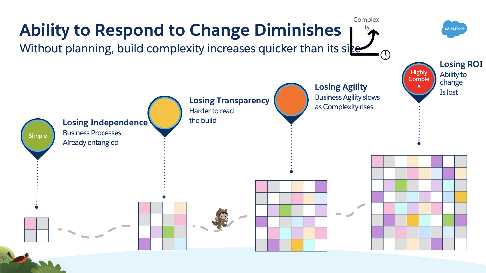

# An Unstructured Org

Before outlining the approach we are recommending and the benefits we
may expect it is important to understand the sorts of situations we are
aiming to avoid (or hoping to repair).

## Emergent Accidental Design in the face of Growth

Many large implementations of Salesforce do not have internal
architectures that were planned. This is often not by negligence on
behalf of any team but a side-effect of a natural evolution. This needs
some explanation.

### How this comes about?

One typical scenario is where a company starts out small on Salesforce
and then puts more functionality into it without a plan on how to grow.

For example a Sales division in a large enterprise buys Salesforce. The
product is excellent and they go through a honeymoon period. They build
some workflows, install lots of AppExchange products and train or hire a
few developers to build up more complex functionality, Another business
area loves what they\'ve done and comes onboard too, their processes are
different but that\'s ok, the config, low code nature of Salesforce
allows this. The success grows, Salesforce starts getting used for
Service and for other geographies and these bring new processing -
perhaps for Service you need new onboarding processes that we trigger on
an account to call out to our customer master or for a new country we
need to have different mandatory fields for a contact. That\'s ok,
Salesforce lets you put conditional logic in your validation rules. We
now have several teams working inside Salesforce, different admins are
adding rules, different devs are putting in different triggers, code
gets harder to manage with lots of switches and teams are not given
extra time by their managers to deliver despite now dealing with a far
more complicated environment.

As we continue to build we reach a point where no one knows the full
consequence of making a change, development slows and sometimes breaks
functionality for other teams, integrations are invisibly updating
fields via the API and extracting unknown numbers of others. We decide
to bring in a new business area which requires the import of millions of
accounts, data sets are prepared and import jobs are prepared but half
of these fail because fields that were mandatory for our existing
Salesforce accounts aren\'t available for our import, some code
somewhere is reformatting addresses in a way that does not work for our
new data, we\'d like to fix this but that format is mandatory for an
AppExchange product that links to a postal service and the mandatory tax
field that one of our processes depends upon is not relevant for the new
data. A simple import ends up taking weeks or months as we untangle a
myriad of knots in our implementation. From this point onwards even a
small change is going to be hard.

A further consideration is that every year the tools available to
developers gets better and better, the number of features that can be
delivered increases in sophistication. This allows for bigger
implementations to be delivered more rapidly than ever before. This is
of course great news but without consideration *from the outset* it can
lead to scaling issues occurring more quickly than ever before.

There are a few variations on this theme but they all have common
challenges and some of this pain could have been avoided.

### When Should the problem have been Addressed?

One of the reasons companies do not architect for scale immediately is
that the challenge is not usually encountered during the first program
that's implemented, in fact creating a scaleable architecture will
create more work at this point. After all, a team is usually "just"
charged with delivering a program and that is what they do. The
challenges however will manifest themselves during subsequent programs
and unless actions are taken will increase with each new program the
company implements. 

The best time to address these was at the very start
of course but there were later points where our hypothetical company
could have avoided the issues:

 

1.  One point is where the second LOB gets added, at this point we will
    inevitably have more than one business owner asking for different
    things, contention in functionality and in timing of changes. 

2.  Another opportunity is when we start to have more than one technical
    team. At this point all the nice-to-haves of a small delivery (build
    standards, governance, code repos, naming conventions) become
    essential and the less frequently addressed items of architectural
    patterns, of only performing a type of task in a single way,
    assigning a scope to each build item come into play. 

The key is to act the moment it becomes clear that they will be using
Salesforce across independent lines of business with multiple business
owners and autonomous processes and support teams. If that is known at
the outset then act at the outset. If a company does not change at (2)
then their build will only get more complex and their ROI will diminish
over time. It is at this point, i.e. multiple LOBs and multiple
supporting teams) that we consider an enterprise to be a **Complex
Implementation. **
